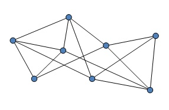

# 用图和邻接矩阵实现 SKU 商品规格选择器

[SKU](https://zh.wikipedia.org/wiki/%E5%AD%98%E8%B4%A7%E5%8D%95%E4%BD%8D) 商品选择器是在电商业务中经常出现的场景，用户购买商品时往往需要选择商品的一些规格，比如款式、颜色、尺码等，页面上要提示用户还有哪些可以选择的规格。


这里假设后端返回了 JK 商品的数据如下：

```javascript
// specs
specsGroup = [
  { title: '款式', list: ['树莓红茶', '柠檬海盐'] },
  { title: '长度', list: ['43cm', '48cm'] },
  { title: '尺码', list: ['S', 'M', 'L'] },
]

// sku,其实可以去除两组数据1，4
products = [
  { id: '1', specs: ['树莓红茶', '43cm', 'S'] },
  { id: '2', specs: ['树莓红茶', '43cm', 'M'] },
  { id: '3', specs: ['树莓红茶', '48cm', 'M'] },
  { id: '5', specs: ['柠檬海盐', '48cm', 'S'] },
  { id: '4', specs: ['柠檬海盐', '48cm', 'L'] },
]
```

要做到的效果为，给用户展所有的规格，并展示有哪些可以选中的规格，其用户选中规格后，提供后续可选中的规格。

把所有的规格放置到界面上，用线联系来，这个结构非常像一张图。有哪些可以选的规格就像极了在图中寻找多个点之间是否互相连通。

## 图



- 有向图
- 无向图

在图的结构中，两个顶点之间如果有连线，则表示这两个顶点是互通的。

## 无向图

用户选择规格的行为是无序的，因此这里用无向图。

将 specsGroup 中的 list 转换为无向图的形式如下（已经根据 products 组合信息将有关联的点之间连接起来）：



由于在 sku 选择器中，同一级的规格也可以被选中。因此同一级之间也要连接起来。



## 邻接矩阵

> 用一个二维数组存放顶点间关系（边或弧）的数据，这个二维数组称为邻接矩阵。

上方的图可用邻接矩阵表示为：

|          | 树莓红茶 | 柠檬海盐 | 43cm | 48cm | S   | M   | L   |
| -------- | -------- | -------- | ---- | ---- | --- | --- | --- |
| 树莓红茶 | 1        | 1        | 1    | 1    | 1   | 1   |     |
| 柠檬海盐 | 1        | 1        |      | 1    | 1   |     | 1   |
| 43cm     | 1        |          | 1    | 1    | 1   | 1   |     |
| 48cm     | 1        | 1        | 1    | 1    | 1   | 1   | 1   |
| S        | 1        | 1        | 1    | 1    | 1   | 1   | 1   |
| M        | 1        |          | 1    | 1    | 1   | 1   | 1   |
| L        |          | 1        |      | 1    | 1   | 1   | 1   |

选中 树莓红茶 时

|          | 树莓红茶 |
| -------- | -------- |
| 树莓红茶 | 1        |
| 柠檬海盐 | 1        |
| 43cm     | 1        |
| 48cm     | 1        |
| S        | 1        |
| M        | 1        |
| L        |          |

选中 树莓红茶+43cm 时

|          | 树莓红茶 | 43cm | 树莓红茶+43cm |
| -------- | -------- | ---- | ------------- |
| 树莓红茶 | 1        | 1    | 1             |
| 柠檬海盐 | 1        |      |               |
| 43cm     | 1        | 1    | 1             |
| 48cm     | 1        | 1    | 1             |
| S        | 1        | 1    | 1             |
| M        | 1        | 1    | 1             |
| L        |          |      |               |

## 这就好了吗

> 并不！

如果选中 48cm+S

|          | 48cm | S   | 48cm+S |
| -------- | ---- | --- | ------ |
| 树莓红茶 | 1    | 1   | 1      |
| 柠檬海盐 | 1    | 1   | 1      |
| 43cm     | 1    | 1   | 1      |
| 48cm     | 1    | 1   | 1      |
| S        | 1    | 1   | 1      |
| M        | 1    | 1   | 1      |
| L        | 1    | 1   | 1      |

进一步选择颜色可组合为

- 树莓红茶 - 48cm - S
- 柠檬海盐 - 48cm - S

然而组合中并没有 树莓红茶 - 48cm - S 这个组合

这是为什么？

尽管上面的方法绘制出的点与点之间的连线可以表示两个点之间是否有连通关系，但这种关系并没有考虑到我们的连接是严格基于组合的，不同组合之间的连线不具有连通性。

## 带有染色连线的图

为了解决上述问题，我们可以在连接两个点时，根据其组合为连线染色(加一个标记)。

因此，两个点之间可能出现多条颜色不一样的连线。（之前的图两个点之间最多只会出现 1 条连线）



用邻接表表示为

- 0 值代表同级连线
- 其他值为组合的 id

|          | 树莓红茶 | 柠檬海盐 | 43cm | 48cm | S   | M   | L   |
| -------- | -------- | -------- | ---- | ---- | --- | --- | --- |
| 树莓红茶 | 0        | 0        | 1,2  | 3    | 1   | 2,3 |     |
| 柠檬海盐 | 0        | 0        |      | 4,5  | 4   |     | 5   |
| 43cm     | 1,2      |          | 0    | 0    | 1   | 2   |     |
| 48cm     | 3        | 4,5      | 0    | 0    | 4   | 3   | 5   |
| S        | 1        | 4        | 1    | 4    | 0   | 0   | 0   |
| M        | 2,3      |          | 2    | 3    | 0   | 0   | 0   |
| L        |          | 5        |      | 5    | 0   | 0   | 0   |

对于这样的邻接表如何计算呢？

- 如果点之间有值，则代表每两个点之间可以被某种颜色的线连通
  - 这些值中如果不包含 0，则求交集。如果有交集则每两个点之间都有同色的可以被连通的线。
  - 如果值中包含 0，则跳过（相当于排除当前点），匹配与其同级的点否有与当前已选中点连通的线。

如果选中 48cm+S

|          | 48cm | S   | 48cm+S |
| -------- | ---- | --- | ------ |
| 树莓红茶 | 3    | 1   |        |
| 柠檬海盐 | 4,5  | 4   | 4      |
| 43cm     | 0    | 1   | 1      |
| 48cm     | 0    | 4   | 4      |
| S        | 4    | 0   | 4      |
| M        | 3    | 0   | 3      |
| L        | 5    | 0   | 5      |

可选点为 柠檬海盐、43cm、48cm、S、M、L

## 参考

[分分钟学会前端 sku 算法（商品多规格选择）- 这篇文章即遇到了上文所述的 bug](https://juejin.im/post/6844904196349640718)

## 其他方案

[sku 多维规格状态判断算法](https://keelii.com/2016/12/22/sku-multi-dimensional-attributes-state-algorithm)
